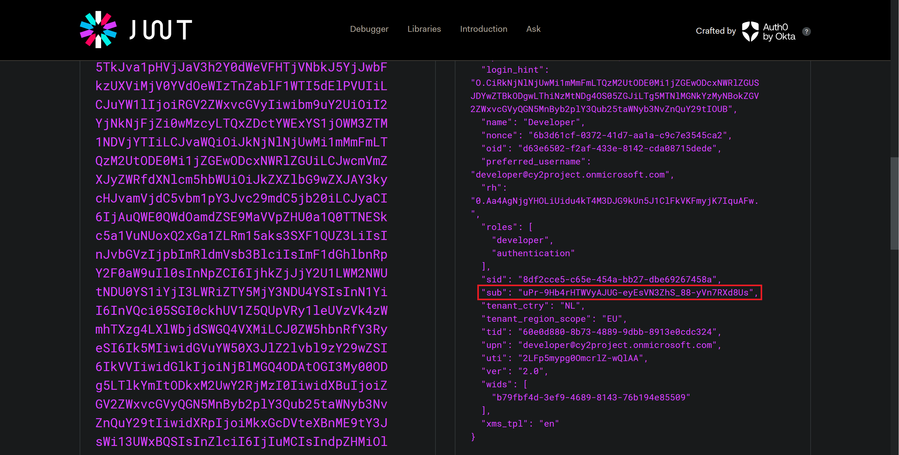

# How to add Users in Azure

### Adding new users to Azure Entra ID

Navigate to Azure Entra ID.

Add user role.

### Adding roles

To add roles go to Enterprise applications.

Then go to Authentication.

Then Users and groups and add a user.

Then assign a role to the user and click Assign.

### Adding user to an organization

Note: As we currently do not have user organization management, we need to add the user role in the database within the `UsersInOrganisation` table.

The `userID` is set by the `sub` value from the Azure idToken.

