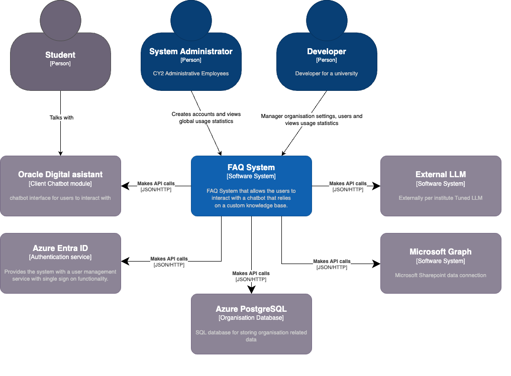
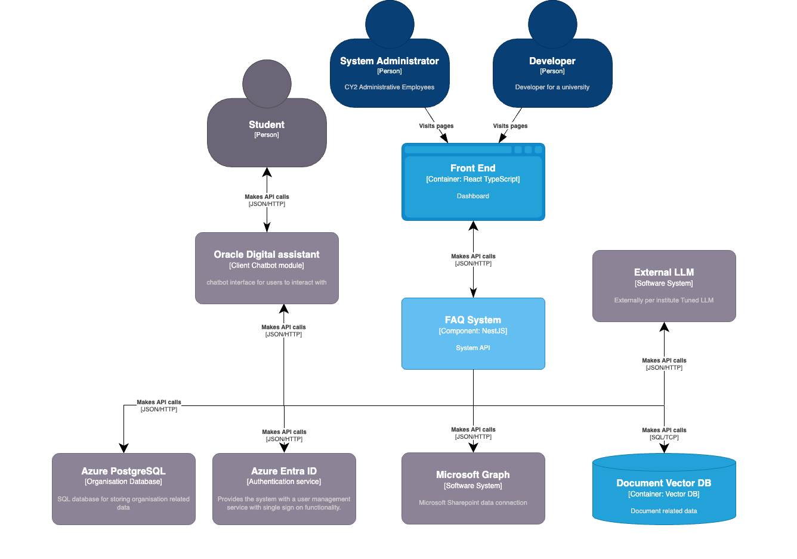
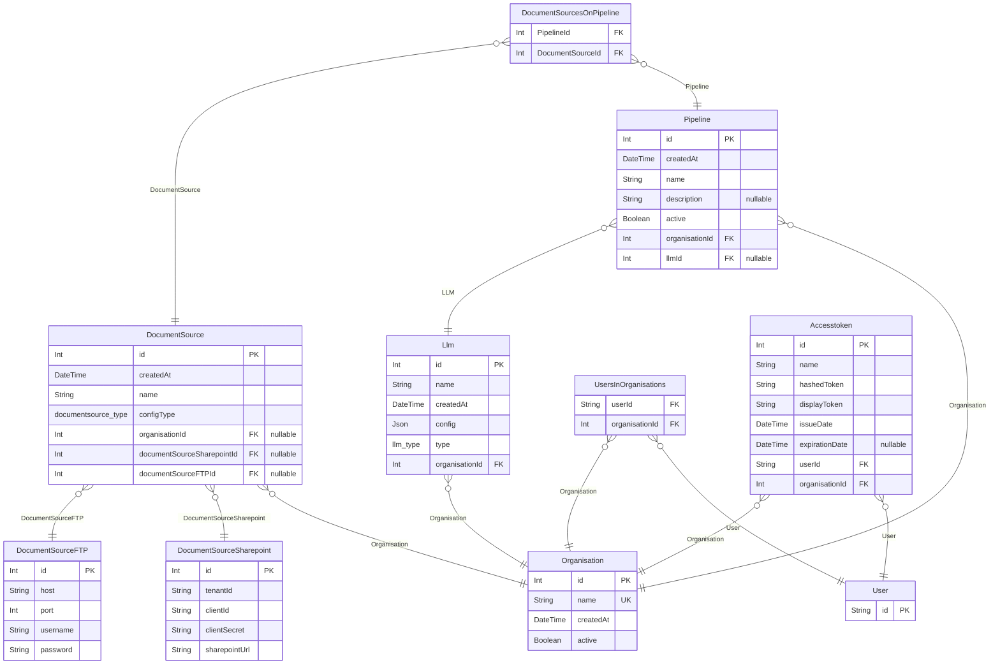

# System Architecture of the CY2 LLM-based FAQ System

## 1. Overview

The CY2 LLM-based FAQ System is designed with a focus on scalability and adaptability to meet the diverse needs of educational institutions. It supports Large Language Models (LLMs) to provide accurate, context-aware responses to user queries in various educational settings. The architecture is adaptable and scalable, enabling integration with different educational institutions' knowledge bases.

## 2. Key Components and Technologies

The system comprises several key components:

- **Frontend Interface:** Built with Node.js, this component serves as the user interface for inputting queries and displaying responses.
- **Backend Services:** Hosted on a Node.js server, this includes modules for authentication, document source management, and chat-bot functionalities.
- **Database:** PostgreSQL is used for storing user information, organization data, and chat logs.
- **Large Language Model Integration:** The system currently integrates OpenAI's LLM for generating responses.
- **Document Source Management:** SharePoint is utilized as the primary document source for storing FAQs and related documents.
- **Pinecone for Vector Database:** Used for creating and managing document embeddings, enhancing information retrieval efficiency.

_Note: Diagrams of the C1, C2, and C3 levels of the architecture are provided below._

## 3. Authentication and Authorization

- **Azure Active Directory (Azure AD):** Used for authentication and authorization, ensuring secure access across different educational institutions.
- **Role-Based Access Control (RBAC):** Facilitates permission management based on user roles within the organization.

## 4. Pipeline Architecture

- **Creation and Management of Pipelines:** Enables creating pipelines that combine LLMs and document sources.
- **Pinecone Integration:** Each pipeline has a namespace in Pinecone for storing and efficiently retrieving embeddings.

## 5. Scalability and Multi-Tenancy

We were considering two posibilities for architectural patterns, microservices and modular monolithic. After studying the client requirements we have chosen to develop a
modular monolith. This approach best fits the requirements, considering the project's scale, the team's size, domain complexity, and the client's necessities to distribute the system as a whole.
The architecture supports multi-tenancy, allowing institutions to use the system with isolated data and customized configurations.
The modular monolith is scalable to handle an increasing number of users and queries without compromising performance.

## 6. Recomendations

To improve the scalability and availability of the system our recomendation is to use Cloud Services. The system could be easily tranferible to clients using a terraform template.

# DIAGRAMS

## ERD Diagram

