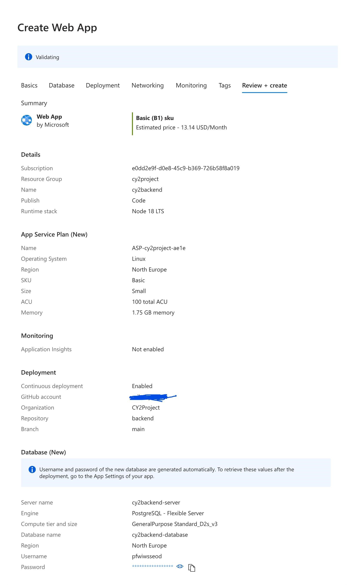
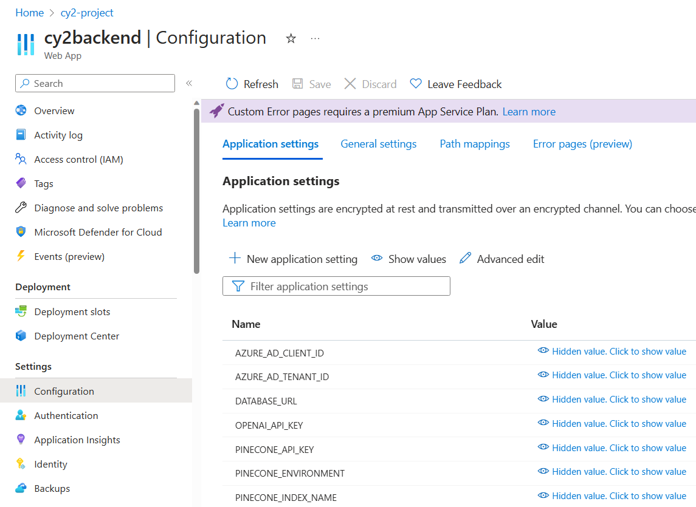
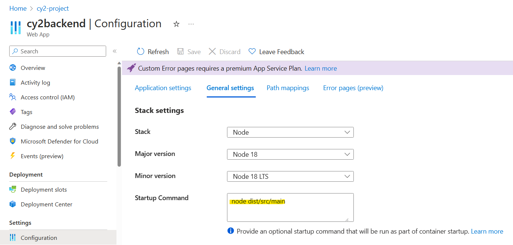

# CY2 FAQ System Deployment

This is a guide on how to deploy the CY2 LLM application for both the frontend & backend. As we are based on Github all CI/CD flows are defined for Github Actions.

- [Prerequisites](#prerequisites)
- [Deployment to the backend](#deployment-of-the-backend)
- [Deployment of the frontend](#deployment-of-the-frontend)

## Prerequisites

1. You have an understanding of the application components.
2. You have familiarity with Github Actions.
3. You have a familiarity with setting up of Azure App Service & Azure Database for PostgreSQL.

## Deployment of the backend

### Setting up Azure App Service

To deploy the application you must Create an [Azure Web App](https://portal.azure.com/#create/Microsoft.WebSite).
You can use the setup below (This step will also create the database):


Once your App is created you must set up the Application Settings (Environmental variables) and the General settings (Startup Command).

In **Application Settings** you must define the environmental variables. You can learn about what each of these environment variables are [here](back-end.md#configuration).


In **General Settings** you must set the Startup Command to `node dist/src/main`:


**Note:** To view application logs you can make use of the Log Stream tab in the [Azure App Services Portal](https://learn.microsoft.com/en-us/azure/app-service/troubleshoot-diagnostic-logs).

### Deployment via Github Actions

In our backend application deployment using Github Actions, we are leveraging certain secrets that are crucial for its smooth operation. These secrets include:

1. **AZUREAPPSERVICE_PUBLISHPROFILE**: This is a necessary secret for publishing our application on Azure App Service. You can obtain the value for the secret by following the instructions provided [here](https://learn.microsoft.com/en-us/visualstudio/azure/how-to-get-publish-profile-from-azure-app-service?view=vs-2022).

2. **DATABASE_URL**: This secret is the connection string for our PostgreSQL database hosted on Azure. It follows the format:
   `postgresql://{username}:{password}@{server}.postgres.database.azure.com:5432`

Please ensure that these secrets are correctly configured in your Github Actions environment to avoid any disruptions in the service.

The following file is found in the .github/workflows directory in the [backend repository](https://github.com/cy2project/backend):

```yaml
name: Build and deploy Node.js app to Azure Web App - cy2-project

on:
  push:
    branches:
      - main
  workflow_dispatch:

jobs:
  build_and_deploy:
    runs-on: ubuntu-latest
    environment:
      name: "Production"
      url: ${{ steps.deploy-to-webapp.outputs.webapp-url }}
    steps:
      - uses: actions/checkout@v4

      - name: Set up Node.js version
        uses: actions/setup-node@v3
        with:
          node-version: "18.x"

      - name: npm install, build, and test
        run: |
          npm install
          npm run build --if-present
          npm run test --if-present

      - name: "Deploy to Azure Web App"
        uses: azure/webapps-deploy@v2
        with:
          app-name: "cy2-project"
          slot-name: "Production"
          publish-profile: ${{ secrets.AZUREAPPSERVICE_PUBLISHPROFILE }}
          package: .

  migrations:
    runs-on: ubuntu-latest
    needs: build_and_deploy
    steps:
      - name: Checkout repo
        uses: actions/checkout@v4
      - name: Setup Node
        uses: actions/setup-node@v3
      - name: Install dependencies
        run: npm install
      - name: Build the app
        run: npm run build
      - name: Apply all pending migrations to the database
        run: npx prisma migrate deploy
        env:
          DATABASE_URL: ${{ secrets.DATABASE_URL }}
```

This GitHub Action is designed to automate the process of building and deploying a Node.js application to an Azure Web App. Here's a step-by-step explanation of what this action does:

1. **Trigger**: The action is triggered when there is a push to the `main` branch or when the workflow is manually dispatched.

2. **Job - Build and Deploy**: This job runs on an `ubuntu-latest` environment and consists of several steps:

   - **Checkout**: Fetches the latest version of the code from the repository.
   - **Set up Node.js version**: Sets up the specified Node.js version (18.x in this case) for the job.
   - **npm install, build, and test**: Installs the necessary npm packages, builds the application, and runs tests if they are present.
   - **Deploy to Azure Web App**: Deploys the application to an Azure Web App named "cy2-project" in the "Production" slot. The deployment uses a publish profile stored in the `AZUREAPPSERVICE_PUBLISHPROFILE` secret.

3. **Job - Migrations**: This job also runs on an `ubuntu-latest` environment and depends on the completion of the `build_and_deploy` job. It performs the following steps:
   - **Checkout repo**: Fetches the latest version of the code from the repository.
   - **Setup Node**: Sets up Node.js for the job.
   - **Install dependencies**: Installs the necessary npm packages.
   - **Build the app**: Builds the application.
   - **Apply all pending migrations to the database**: Applies all pending migrations to the database using Prisma. The `DATABASE_URL` secret is used to connect to the database.

In summary, this action automates the process of building, testing, and deploying a Node.js application to Azure, as well as applying database migrations. This helps ensure that the application is always up-to-date with the latest changes in the `main` branch.

## Deployment of the frontend

### Using Vercel

We made use of Vercel to deploy the application due to its simplicity of use.

You can follow the guide to deploy Git repositories with Vercel [here](https://vercel.com/docs/deployments/git).

### Using Docker Image

**Note**: The actual deployment to a server or a hosting platform is not included in this workflow as we are using Vercel Git integration.

```yaml
name: Build and Push Docker Image

on:
  push:
    branches:
      - main

jobs:
  build:
    runs-on: ubuntu-latest

    env:
      DOCKER_USERNAME: ${{ secrets.DOCKERHUB_USERNAME }}
      DOCKER_PASSWORD: ${{ secrets.DOCKERHUB_PASSWORD }}
      REACT_APP_REDIRECT_URI: ${{ secrets.REACT_APP_REDIRECT_URI }}
      REACT_APP_CLIENT_ID: ${{ secrets.REACT_APP_CLIENT_ID }}
      REACT_APP_AUTHORITY_ID: ${{ secrets.REACT_APP_AUTHORITY_ID }}
      REACT_APP_BACK_END_BASE_URL: ${{ secrets.REACT_APP_BACK_END_BASE_URL }}

    steps:
      - name: Checkout code
        uses: actions/checkout@v2

      - name: Login to GitHub Hub
        run: docker login -u $DOCKER_USERNAME -p $DOCKER_PASSWORD

      - name: Build and push Docker image
        run: |
          docker build -t $DOCKER_USERNAME/frontend:latest \
            --build-arg REACT_APP_REDIRECT_URI="${REACT_APP_REDIRECT_URI}" \
            --build-arg REACT_APP_CLIENT_ID="${REACT_APP_CLIENT_ID}" \
            --build-arg REACT_APP_AUTHORITY_ID="${REACT_APP_AUTHORITY_ID}" \
            --build-arg REACT_APP_BACK_END_BASE_URL="${REACT_APP_BACK_END_BASE_URL}" \
            .
          docker push $DOCKER_USERNAME/frontend:latest
```

This action does the following:

1. **Trigger**: The action is triggered when there is a push to the `main` branch or when the workflow is manually dispatched.

2. **Checkout code**:
   Uses the actions/checkout action to fetch the latest version of the code.
3. **Login to DockerHub**:
   Uses the docker login command to authenticate with DockerHub using the provided DockerHub `DOCKER_USERNAME` and `DOCKER_PASSWORD` secrets.
4. **Build and Push Docker Image**:

   - A Docker image is constructed utilizing the `docker build` command, and it's labeled as `$DOCKER_USERNAME/frontend:latest`. This construction employs certain build arguments to pass needed environmental variables from the Github action secrets to the Docker build. These environment variables are:

   1. **REACT_APP_REDIRECT_URI**
   2. **REACT_APP_CLIENT_ID**
   3. **REACT_APP_AUTHORITY_ID**
   4. **REACT_APP_BACK_END_BASE_URL**
      You can learn about what each of these environment variables are [here](front-end.md#configuration).

   - Pushes the built Docker image to DockerHub using the docker push command.
