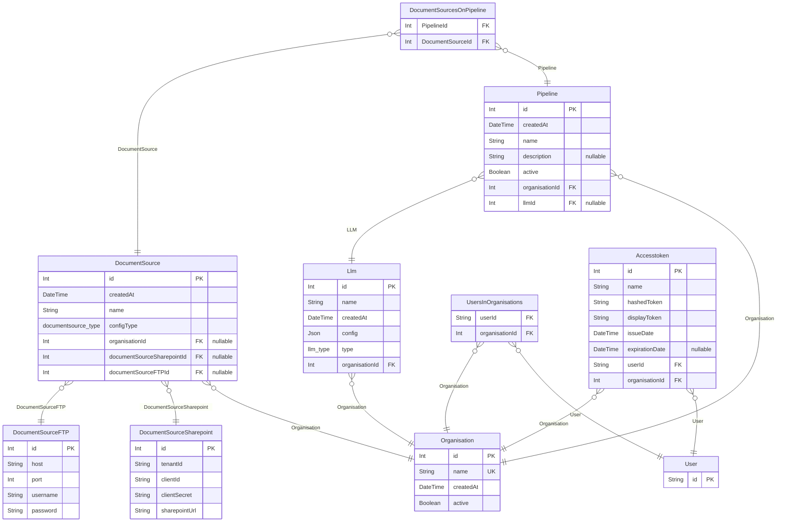

```mermaid
erDiagram
"Llm" {
    Int id PK
    String name
    DateTime createdAt
    Json config
    llm_type type
    Int organisationId FK
}
"DocumentSourceSharepoint" {
    Int id PK
    String tenantId
    String clientId
    String clientSecret
    String sharepointUrl
}
"DocumentSourceFTP" {
    Int id PK
    String host
    Int port
    String username
    String password
}
"Pipeline" {
    Int id PK
    DateTime createdAt
    String name
    String description "nullable"
    Boolean active
    Int organisationId FK
    Int llmId FK "nullable"
}
"DocumentSourcesOnPipeline" {
    Int PipelineId FK
    Int DocumentSourceId FK
}
"DocumentSource" {
    Int id PK
    DateTime createdAt
    String name
    documentsource_type configType
    Int organisationId FK "nullable"
    Int documentSourceSharepointId FK "nullable"
    Int documentSourceFTPId FK "nullable"
}
"Organisation" {
    Int id PK
    String name UK
    DateTime createdAt
    Boolean active
}
"UsersInOrganisations" {
    String userId FK
    Int organisationId FK
}
"Accesstoken" {
    Int id PK
    String name
    String hashedToken
    String displayToken
    DateTime issueDate
    DateTime expirationDate "nullable"
    String userId FK
    Int organisationId FK
}
"User" {
    String id PK
}
"Llm" }o--|| "Organisation" : Organisation
"Pipeline" }o--|| "Organisation" : Organisation
"Pipeline" }o--|| "Llm" : LLM
"DocumentSourcesOnPipeline" }o--|| "Pipeline" : Pipeline
"DocumentSourcesOnPipeline" }o--|| "DocumentSource" : DocumentSource
"DocumentSource" }o--|| "Organisation" : Organisation
"DocumentSource" }o--|| "DocumentSourceSharepoint" : DocumentSourceSharepoint
"DocumentSource" }o--|| "DocumentSourceFTP" : DocumentSourceFTP
"UsersInOrganisations" }o--|| "User" : User
"UsersInOrganisations" }o--|| "Organisation" : Organisation
"Accesstoken" }o--|| "User" : User
"Accesstoken" }o--|| "Organisation" : Organisation
```
