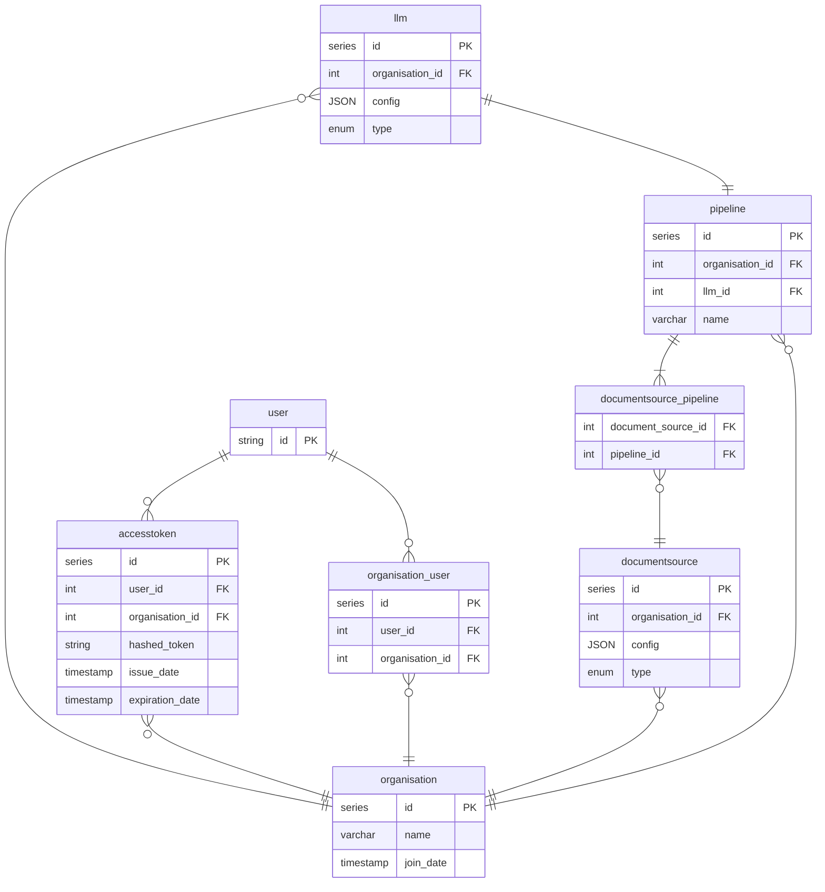

## 
CY2 FAQ System ERD V0.1

<!-- accesstoken_organisation {
    series id PK
    int accesstoken_id FK
    int organisation_id FK
} 

accesstoken ||--|{ accesstoken_organisation : ""
accesstoken_organisation }|--|| organisation: ""

-->
