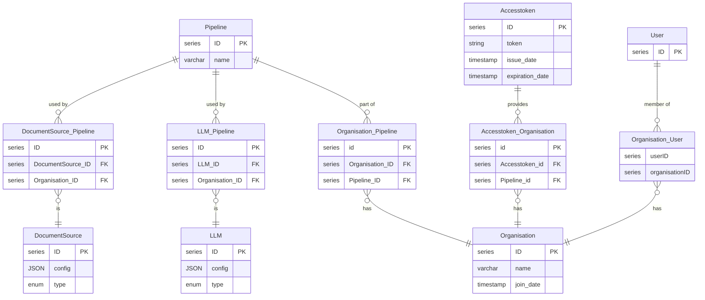

# Documents

```mermaid
erDiagram

Pipeline ||--o{ DocumentSource_Pipeline : "used by"
DocumentSource_Pipeline }o--|| DocumentSource: is

Pipeline ||--o{ LLM_Pipeline : "used by"
LLM_Pipeline }o--|| LLM: is

Accesstoken ||--o{ Accesstoken_Organisation : provides
Accesstoken_Organisation }o--|| Organisation: "has"

Pipeline ||--o{ Organisation_Pipeline : "part of"
Organisation_Pipeline }o--|| Organisation: "has"

User ||--o{ Organisation_User : "member of"
Organisation_User }o--|| Organisation: "has"


Organisation {
    series ID PK
    varchar name
    timestamp join_date
}

User {
    series ID PK
}

Accesstoken {
    series ID PK
    string token
    timestamp issue_date
    timestamp expiration_date
}

DocumentSource {
    series ID PK
    JSON config
    enum type
}

LLM {
    series ID PK
    JSON config
    enum type
}

Pipeline {
    series ID PK
    varchar name
}

DocumentSource_Pipeline {
    series ID PK
    series DocumentSource_ID FK
    series Organisation_ID FK
}

LLM_Pipeline {
    series ID PK
    series LLM_ID FK
    series Organisation_ID FK
}

Organisation_User {
    series userID
    series organisationID
}

Accesstoken_Organisation {
    series id PK
    series Accesstoken_id FK
    series Pipeline_id FK
}

Organisation_Pipeline {
    series id PK
    series Organisation_ID FK
    series Pipeline_ID FK
}

```
