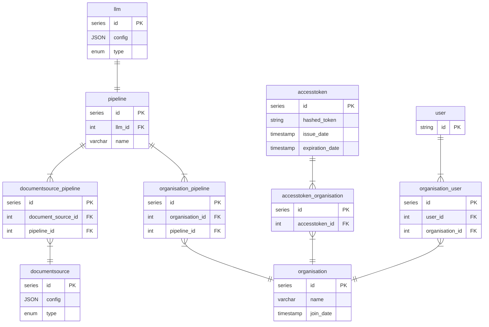

# Documents

```mermaid
erDiagram

pipeline ||--|{ documentsource_pipeline : ""
documentsource_pipeline }|--|| documentsource: ""

accesstoken ||--|{ accesstoken_organisation : ""
accesstoken_organisation }|--|| organisation: ""

pipeline ||--|{ organisation_pipeline : ""
organisation_pipeline }|--|| organisation: ""

user ||--|{ organisation_user : ""
organisation_user }|--|| organisation: ""

llm ||--|| pipeline : ""


organisation {
    series id PK
    varchar name
    timestamp join_date
}

user {
    string id PK
}

accesstoken {
    series id PK
    string hashed_token
    timestamp issue_date
    timestamp expiration_date
}

documentsource {
    series id PK
    JSON config
    enum type
}

pipeline {
    series id PK
    int llm_id FK
    varchar name
}

llm {
    series id PK
    JSON config
    enum type
}

documentsource_pipeline {
    series id PK
    int document_source_id FK
    int pipeline_id FK
}

organisation_user { 
    series id PK
    int user_id FK
    int organisation_id FK
}

accesstoken_organisation {
    series id PK
    int accesstoken_id FK
}

organisation_pipeline {
    series id PK
    int organisation_id FK
    int pipeline_id FK
}
```
